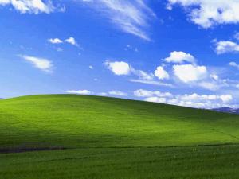

# NImg
Extremely lossy image compression with neural networks

Uses the limited, slow, and inefficient (but super simple and easy-to-use!) feed-forward neural network [Zoltar](https://github.com/matthewsot/zoltar).

# Show me the numbers
Using tolerance values of 10 and 3 (essentially each R/G/B component of each pixel of the uncompressed image must be within 13 units of the original).

Original PNG image, **106,638 bytes** uncompressed and 106,795 bytes when compressed with the default Windows "send-to" compression:

**106,638 bytes**

Original image saved as a JPEG in Paint.net, 53,185 bytes as .jpg, **53,067 bytes** after compressed to .zip:

**53,067 bytes**

Compressed into an .nimg file of **1,422 bytes**. After reconstructing the .nimg into a PNG:

**1,417 bytes**

That's a **98.6% reduction** from the original PNG and **97.3% reduction** from the compressed JPEG.